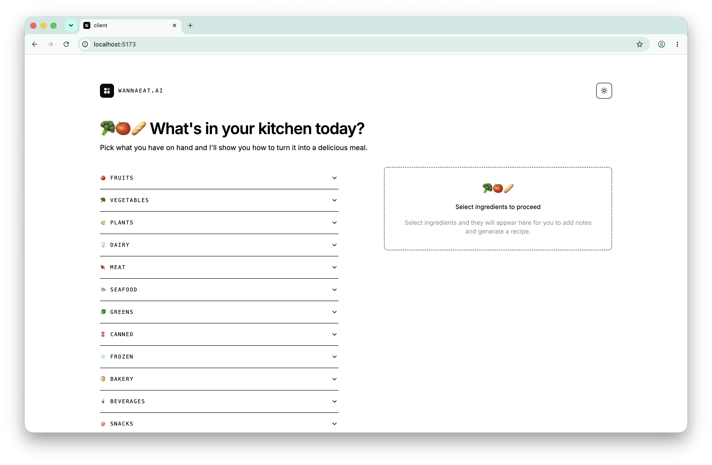
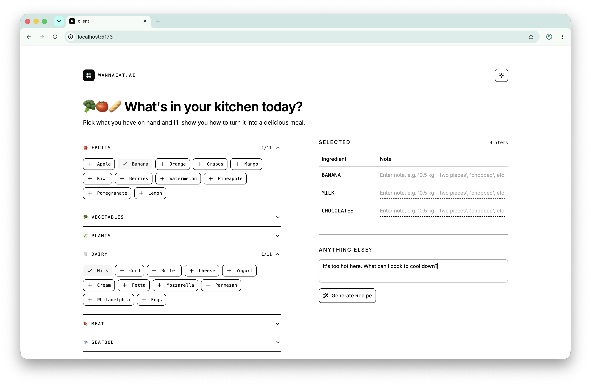
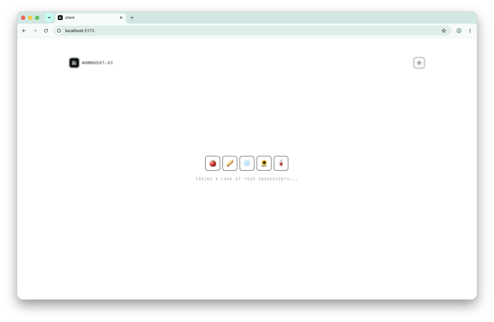
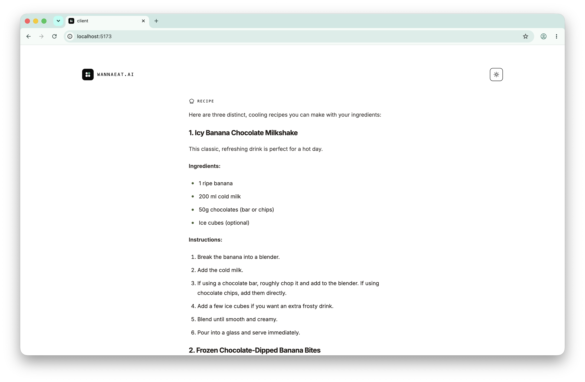

# WannaEat.AI

This is a simple web application that allows users to input a list of ingredients and receive recipe suggestions based on those ingredients. 

The application is built using React and TypeScript, and it utilizes the Gemini API to generate recipe suggestions.

## Demo

